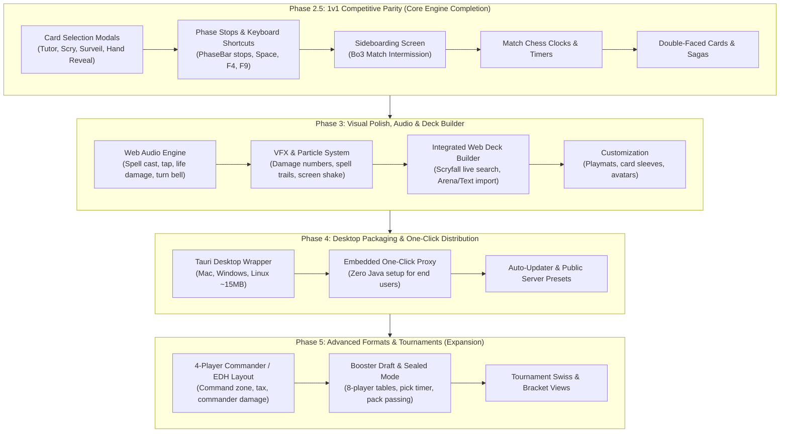

# Project Roadmap: XMage Nexus

> **A Modern, Web-Based Digital Card Game Client for XMage**  
> *Last updated: 2026-08-21*

---

## 1. Vision & Architectural Philosophy

The goal of **XMage Nexus** is to deliver a fast, modern, and beautiful web client with an **Arena-grade aesthetic** (WebGL2 rendering, animated targeting, sound, smooth interaction) while leveraging the battle-tested, 10-year **XMage Java server** (`Mage.Server`) as the authoritative rules engine, card database (+25,000 cards), and multiplayer matchmaking backend.

### The 3-Tier Architecture
```
┌─────────────────────────┐          WebSocket JSON          ┌──────────────────────────┐      JBoss / TCP      ┌─────────────────────────┐
│  XMage Nexus Web Client │ ◄──────────────────────────────► │        Mage.Proxy        │ ◄───────────────────► │      XMage Server       │
│  (React 19 + PixiJS)    │   (Type-safe protocol schema)    │  (Java 17 / MageClient)  │   (Native protocol)   │  (1.4.61-V1 / Official) │
└─────────────────────────┘                                  └──────────────────────────┘                       └─────────────────────────┘
```

- **Zero Rules Re-implementation**: XMage handles all legality, priority checks, layers, triggers, timers, and state-based actions.
- **Clean Decoupling**: The Java proxy acts as a legitimate `MageClient`, translating JBoss serialization into clean, reflection-safe JSON.
- **Asynchronous State Machine**: The web client uses non-blocking reactive stores, monotonic state tracking, and floating UI dialogs to bridge XMage's synchronous Swing origins into modern web paradigms.

---

## 2. Current State Assessment (Verified & Completed)

The project has successfully conquered the most difficult engineering hurdles (protocol bridging, async feedback loops, mana payments, targeting):

| Milestone | Scope | Status | Verification & Evidence |
|---|---|---|---|
| **Phase 0: Proxy Bridge** | Java 17 proxy (`Mage.Proxy`), WebSocket gateway, cycle-safe JSON serializer. | ✅ **Completed** | Connect + real game flow works against `beta.xmage.today:17171` AND local `localhost:17171` (same 1.4.61-V1 fork). NOTE: beta's anonymous-login handshake is intermittently fatal server-side (`Can't receive server state before other data`) and is **not** fixed by any proxy buffer — beta is best-effort only; CI's real-protocol oracle is the local server. The proxy is now **multi-tenant** (one process serves many independent users), which already enables zero-install server-side play today (see `AGENTS.md`). |
| **Phase 1: Web Foundation** | React 19 + TS + Vite + PixiJS 8. Lobby, room chat, real-time tables/users, Scryfall HD card cache (IndexedDB), full 1v1 board rendering & spectator mode. | ✅ **Completed** | 100% typecheck clean, live AI vs AI spectator matches working end-to-end. |
| **Phase 2: Interaction Engine** | London mulligan, priority loops (`GAME_SELECT`), visual targeting (animated dotted lines & pulsing glows), mana tapping & pool payment (`sendPlayerManaType`), floating non-blocking combat UI (attack/block & alpha strike), advanced spell interactions (X-costs, multi-target, modal choices, +1/+1 counters). | ✅ **Completed** | Validated via `human-test.mjs` (83 checks PASS) and Playwright E2E suites (*Blaze*, *Arc Trail*, *Boros Charm*, *Walking Ballista*). |
| **Quality & QA Foundation** | 105 unit tests (vitest, <1s), Java→TS JSON Schema codegen (`gen-types.mjs`), dual-mode Playwright E2E (deterministic FakeServer + Real XMage Stack with `SimPlayer` bots). | ✅ **Completed** | Zero-flake local iteration loop + continuous anti-drift contract testing (3 guards: `callbackCoverage`, `mechanicsCoverage` server→client, `engineViewCoverage` engine→view). |

---

## 3. Feature Parity Matrix: Official XMage (Swing) vs. XMage Nexus

| Category | Feature | Official XMage (Swing) | XMage Nexus (Current) | Roadmap Phase |
|---|---|---|---|---|
| **Connectivity & Lobby** | Connect to Local / Custom / Public Server (`beta.xmage.today`) | ✅ Yes | ✅ Yes | Completed |
| | Real-time Table & User Broadcasts | ✅ Yes | ✅ Yes | Completed |
| | Room & Match Chat | ✅ Yes | ✅ Yes | Completed |
| | 1v1 Table Creation (Human vs Human / Human vs AI) | ✅ Yes | ✅ Yes | Completed |
| | Table Filters & Private Messaging (Whispers/PM) | ✅ Yes | ❌ No | Phase 3 |
| | Match Clocks / Visible Timers | ✅ Yes | 🟡 Backend-only | **Phase 2.5** |
| **Deck Management** | Predefined / JSON Deck Loading | ✅ Yes | ✅ Yes | Completed |
| | Full-featured In-App Deck Builder with Scryfall Filters | ✅ Yes (Local DB) | ❌ No | Phase 3 |
| | Text / Arena / Standard Deck Import & Export | ✅ Yes | ❌ No | Phase 3 |
| **1v1 In-Game Board** | Hand, Battlefield (Lands / Creatures / Non-creatures) | ✅ Yes | ✅ Yes (HD Art) | Completed (Surpasses Swing) |
| | Stack, Library, Graveyard, Exile | ✅ Yes | ✅ Yes | Completed |
| | Tap Rotations, Life Totals, Counters (+1/+1, loyalty) | ✅ Yes | ✅ Yes | Completed |
| | Graveyard / Exile Pile Inspector Overlays | ✅ Yes | ✅ Yes | Completed |
| | Double-Faced Cards (Transform, MDFC, Sagas) | ✅ Yes | 🟡 Front-face only | **Phase 2.5** |
| **In-Game Rules & Prompts** | Priority & Turn Passing (`GAME_SELECT`) | ✅ Yes | ✅ Yes | Completed |
| | Mana Payment (Tapping lands on board + color pool) | ✅ Yes | ✅ Yes | Completed |
| | Visual Targeting (Outlines, arrows to cards/players) | ❌ Crude lines | ✅ Dotted animated lines + Glow | Completed (Surpasses Swing) |
| | Complex Spells (X-costs, Modals, Multi-target) | ✅ Yes | ✅ Yes | Completed |
| | Interactive Combat (Declare Attackers / Blockers) | ✅ Yes | ✅ Yes (Floating UI) | Completed |
| | **Card Selection Lists (Tutors, Scry, Surveil, Hand Reveal)** | ✅ Yes (`ShowCardsDialog`) | ❌ No | **Phase 2.5 (Priority)** |
| | **Phase Stops & Priority Shortcuts (F4, F9, Space)** | ✅ Yes | ❌ No (Manual pass only) | **Phase 2.5 (Priority)** |
| | **Sideboarding Screen between Bo3 Matches** | ✅ Yes | ❌ No | **Phase 2.5 (Priority)** |
| | Multi-blocker Damage Assignment Order | ✅ Yes | 🟡 Auto-assigned | Phase 2.5 |
| **Presentation & Audio** | Sound Effects (Turn bell, life loss, spell cast, combat) | ✅ Basic | ❌ No | Phase 3 |
| | VFX & Animations (Spell cast arcs, screen shake, damage) | ❌ No | 🟡 Motion tweens | Phase 3 |
| **Distribution** | Desktop & Web Deployment | ❌ Heavy JRE required | 🟡 Web / ⬜ Tauri App | Phase 4 |
| **Advanced Formats** | 4-Player Commander / EDH (Command zone, tax, damage) | ✅ Yes | ❌ No (1v1 Layout) | Phase 5 |
| | Booster Draft & Sealed Tournaments (Pick timer, packs) | ✅ Yes | ❌ No | Phase 5 |

---

## 4. Phased Implementation Roadmap



---

### Phase 2.5: 1v1 Competitive Parity (Core Engine Completion)
*Objective: Make the web client 100% playable for all sanctioned 1v1 Constructed formats (Modern, Standard, Pioneer, Legacy, Vintage, Pauper).*

#### 2.5.1 Card Selection Modals (Tutors, Scry, Surveil, Hand Reveal) — **CRITICAL**
- **XMage Events**: `GAME_CHOOSE_CARDS`, `SHOW_CARDS`, `GAME_TARGET` with `cardsView1` lists.
- **Features**:
  - Modal card-grid overlay styled after modern digital card games.
  - Search library (Fetchlands, Demonic Tutor).
  - Scry / Surveil / Look at top N cards (allow reordering/placing on top or bottom).
  - Reveal hand effects (*Thoughtseize*, *Inquisition of Kozilek*): view opponent's hand in a dedicated reveal window and click to discard.
  - Graveyard / Exile selective interactions (reanimation, flashback picker).

#### 2.5.2 Phase Stops & Priority Shortcuts — **CRITICAL**
- **Features**:
  - Interactive stop markers on `PhaseBar`: click on specific steps (Upkeep, Draw, Precombat Main, Beginning of Combat, Declare Attackers, End of Combat, Postcombat Main, End Step) to set personal stops.
  - Standard priority keyboard shortcuts:
    - **Space / Enter**: Yield current priority (pass).
    - **F4**: Pass priority until stack is non-empty or an opponent acts.
    - **F9**: Pass all priority until end of turn.
    - **Ctrl**: Hold full priority.

#### 2.5.3 Sideboard Screen (Best-of-3 / Best-of-5 Matches) — **HIGH**
- **Features**:
  - Intermission screen between match games when `GAME_SIDEBOARD` is received.
  - Two-column visual deck editor (Maindeck $\leftrightarrow$ Sideboard).
  - Drag-and-drop / single-click card swap with real-time deck size validation.
  - Countdown timer for sideboarding with "Submit Deck" action.

#### 2.5.4 Match Clocks & Priority Timers — **MEDIUM**
- **Features**:
  - Render active chess clocks for both players (turn timer & match timer).
  - Visual warning indicators when player time drops below critical thresholds (flashing amber/red).

#### 2.5.5 Double-Faced Cards (DFCs), MDFCs & Sagas — **MEDIUM**
- **Features**:
  - Card flip button / keyboard shortcut to preview and choose the back face of MDFCs in hand.
  - In-play transformation animations/transitions.
  - Saga layout with active chapter token overlay.

#### 2.5.6 Multi-Blocker Combat Damage Assignment — **LOW**
- **Features**:
  - Reorder blocker assignment dialog when an attacking creature is blocked by multiple defending creatures.

---

### Phase 3: Visual Polish, Audio & Integrated Deck Builder
*Objective: Transform the functional client into a premium, responsive Arena-quality experience.*

#### 3.1 Audio Engine (Web Audio API)
- Sound FX for core interactions: card draw, card tap, spell cast whoosh, land drop, creature attack impact, life total counter tick, turn bell/notification chimes.
- Volume sliders in settings (Master, SFX, Ambient).

#### 3.2 VFX & Particle System (PixiJS)
- Spell resolution visual trajectories (arcs from hand $\to$ stack $\to$ battlefield/graveyard).
- Particle effects tailored to card colors (Red fire, Blue arcane sparkles, Green nature wisps, White holy light, Black dark smoke).
- Combat impact effects: screen shake on heavy damage, floating $-X$ life numbers.

#### 3.3 Integrated Web Deck Builder
- In-client Scryfall search with full syntax (`t:creature c:red cmc<=3 o:"haste"`).
- Visual deck view (stacks sorted by mana cost, color breakdown chart, mana curve histogram).
- One-click clipboard import/export in Arena, plain text, and `.dck` formats.
- Sample hand generator (Goldfish opening hand simulator).

#### 3.4 Player Customization
- Selectable playmat background themes (Dark fantasy, Sci-fi, Minimalist wood, Animated nebula).
- Custom card back sleeves.

---

### Phase 4: Desktop Packaging & One-Click Distribution (Tauri)
*Objective: Provide a friction-free, zero-setup desktop application for non-technical users.*

#### 4.1 Tauri Native Wrapper
- Lightweight desktop application (<15 MB installer for Windows, macOS, and Linux).
- Native window chrome, hardware-accelerated WebGL viewport, and OS-native notifications when priority arrives while tabbed out.

#### 4.2 Embedded Proxy & JRE Management
- Bundle a headless, ultra-stripped OpenJDK 17 runtime + `mage-proxy.jar`.
- One-click launcher: automatically boots the local proxy in the background, handles port binding, and connects the UI instantly without user intervention.
- Preset selector: "Official Public Server (`beta.xmage.today`)" vs "Local Server" vs "Custom Server".

#### 4.3 Seamless Auto-Updater
- In-app background update downloads when new proxy or web releases are published.

---

### Phase 5: Advanced Game Modes & Tournaments (Expansion)
*Objective: Extend the platform to support popular casual and limited formats.*

#### 5.1 4-Player Commander (EDH) / Brawl
- 4-quadrant dynamic board layout with individual player life totals, mana pools, and status bars.
- Dedicated Command Zone for each player displaying Commander cards.
- Trackers for Commander Tax ($+2$ per cast) and Commander Damage matrices (tracking damage dealt by each commander to each player).
- Turn order ring visualizer.

#### 5.2 Booster Draft & Sealed Tournaments
- 8-player draft table room with synchronous pick timers.
- Booster pack opening animation and card pick selection grid.
- Pack passing indicators (Pack 1 Left, Pack 2 Right, Pack 3 Left).
- Integrated 40-card limited deck builder during deckbuilding rounds.

#### 5.3 Swiss & Single Elimination Tournament Brackets
- Real-time tournament lobby with bracket visualization, pairing announcements, and standings tables.

---

## 5. Technical Complexity & Effort Matrix

| Phase | Milestone | Technical Complexity | Core Dependencies |
|---|---|---|---|
| **Phase 2.5** | Card Selection Modals | 🟡 Medium | React Card Grid, `GAME_CHOOSE_CARDS` mapper |
| **Phase 2.5** | Phase Stops & F4/F9 Shortcuts | 🟡 Medium | `PhaseBar` state, key listener, auto-pass logic |
| **Phase 2.5** | Sideboard Screen | 🟢 Low-Medium | 2-column drag-drop UI, `GAME_SIDEBOARD` action |
| **Phase 2.5** | Match Clocks | 🟢 Low | Client-side countdown syncing with server updates |
| **Phase 2.5** | Double-Faced Cards / Sagas | 🟢 Low-Medium | Scryfall back-face cache, card hover flip |
| **Phase 3** | Audio Engine | 🟢 Low | Web Audio API / Howler.js, sound asset pack |
| **Phase 3** | VFX & Particle System | 🟡 Medium | PixiJS 8 particle emitter & tween engine |
| **Phase 3** | In-App Deck Builder | 🟡 Medium | Scryfall REST API search, text format parsers |
| **Phase 4** | Tauri Desktop Launcher | 🟢 Low-Medium | Tauri 2.0, Rust process launcher for Java JAR |
| **Phase 5** | 4-Player Commander Layout | 🔴 High | Complete board geometry overhaul (4 quadrants) |
| **Phase 5** | Booster Draft & Tournament System | 🔴 High | Multi-client draft synchronization, draft timers |

---

## 6. Execution Guidelines

1. **Protocol-First Rule**: Never mutate client state optimistically without an authoritative server update. Player actions are intents sent to the proxy; the resulting `GameView` dictates the UI state.
2. **Schema Invariant**: Whenever proxy Java event models change, execute `node scripts/gen-types.mjs --validate` to keep TypeScript contract definitions strictly in sync.
3. **Dual-Testing Requirement**:
   - Fast UI/logic changes must pass `npm run test` (vitest) and `npm run test:e2e:fake` (Playwright against FixtureServer).
   - Core protocol/interaction changes must pass `node scripts/test.mjs` against the live stack with `SimPlayer` bots.
4. **Zero Flake Policy**: Avoid canvas byte-diff comparisons in E2E tests. Assert against deterministic scene state exposed on `window.__mageScene`.

---

## 7. Standardized Card Component Architecture

### 1. Special Card Morphology (MDFCs, Transform, Adventures, Sagas)

In modern card games, many cards are not static single-faced rectangles:

• Double-Faced Cards (MDFCs / Transform / Battles): e.g. Delver of Secrets, Valakut Awakening, Invasion of Zendikar.
• Adventures and Split Cards: e.g. Brazen Borrower // Petty Theft, Fire // Ice.
• Sagas and Classes: Have chapters (I, II, III) or levels that progress with counters.
• Tokens: Creatures, Treasures, Food, Clues, Maps, Blood.

```
  ┌──────────────────────────┐           ┌──────────────────────────┐
  │ [Delver of Secrets]  (U) │           │ [Insectile Aberration]   │
  │ 1/1 Creature - Wizard    │  ──(⟲)──▶ │ 3/2 Creature - Insect    │
  │ At the beginning of...   │   Flip    │ Flying                   │
  │                    [ ⟲ ] │           │                    [ ⟲ ] │
  └──────────────────────────┘           └──────────────────────────┘
```

#### How it is standardized (MultiFaceCard Pattern):
• In data: XMage already exposes `secondCardFace`, `isTransformed`, `isToken`, and `counters.LORE` in `CardView`.
• In UI:
  1. A floating flip button ⟲ (or keyboard shortcut / hover) on the card corner to preview the back face in hand and graveyard.
  2. On the battlefield, if `isTransformed === true`, automatically render the face-B texture (Scryfall indexes this as `card_faces[1]`).
  3. For Sagas and Classes, a badge on the card showing the current chapter (`ChapterBadge: [II]`).

──────
### 2. Attachment Hierarchy (Auras, Equipment, Mutate)

When playing an Aura or Equipment, they attach to a creature. In Mutate mechanics, multiple cards stack under/over the host creature.

```
  ┌──────────────────────────────┐
  │  ┌───────────────────────┐   │  (Equipment)
  │  │ ┌───────────────────┐ │   │
  │  │ │                   │ │   │
  │  │ │ Host Creature (5/6)│ │  │
  │  │ │                   │ │   │
  │  │ └───────────────────┘ │   │
  │  └───────────────────────┘   │
  └──────────────────────────────┘
```

#### How it is standardized (AttachmentAnchor Pattern):
• In data: XMage sends `attachedTo: UUID` or `attachments: UUID[]` on each permanent.
• In UI:
  1. Rather than occupying independent slots on the battlefield, attachments render cascaded behind the host creature (offset 10px up/right).
  2. If the host creature taps or attacks, all its attachments move along with it as a single unit.

──────
### 3. Global State Indicators and Player Counters

In addition to life and mana, the game engine tracks persistent global states and counters:

• Player counters: Poison (Poison ≥ 10 = defeat), Energy, Experience, Radiation (Rad counters).
• Global designation states:
  • The Monarch (👑).
  • The Initiative / Dungeons (🏰).
  • Day / Night (☀️ / 🌙).
  • City's Blessing.
• Planeswalker Emblems: Permanent passive abilities.

#### How it is standardized (PlayerBadgeStrip & EmblemTray Pattern):
• In data: `PlayerView` includes `counters.POISON`, `isMonarch`, `hasCitysBlessing`, and `GameView.emblems`.
• In UI: A compact pill bar beside player life:
  `[ 💖 20 ] [ 💀 3 ] [ ⚡ 4 ] [ 👑 Monarch ] [ ☀️ Day ]`
  Hovering over an emblem opens the enlarged card preview.

──────
### 4. Keyword Ability Badges

In a match with many creatures on the board, reading card text to check for Flying, Deathtouch, or Trample creates cognitive load.

```
  ┌────────────────────────┐
  │  Questing Beast   4/4  │
  │                        │
  │   [🪽] [⚡] [☠️] [🛡️]  │  ◄── Visual badges on the frame
  └────────────────────────┘
```

#### How it is standardized (KeywordBadgeSet Pattern):
• In data: `CardView.rules` and `CardView.abilities` contain parsed keywords.
• In UI: A set of micro SVG icons on the lower-left corner of the permanent:
  • 🪽 Flying / Reach
  • ⚡ Haste / First Strike
  • ☠️ Deathtouch
  • 🦏 Trample
  • 🛡️ Vigilance / Hexproof / Ward
  • 💖 Lifelink

──────
### 5. Revealed Information / Known Cards (Known Information Tray)

When an effect reveals an opponent's hand, those cards remain public knowledge until played or discarded.

```
  ┌────────────────────────────────────────────────────────┐
  │  Opponent's Hand:   [ 🂠 ] [ 🂠 ] [ 🂠 ]                 │  (3 hidden cards)
  │  Known Cards:       [ Bolt ] [ Push ]                  │  (Previously revealed)
  └────────────────────────────────────────────────────────┘
```

#### How it is standardized (KnownHandTracker Pattern):
• In data: XMage tracks shown cards in `PlayerView.revealedHand`.
• In UI: A miniature tray directly above the opponent's hidden hand displaying verified known cards face up.

──────
### Summary of Component Architecture

| Standard Component | Solves | Implementation Complexity |
|---|---|---|
| `MultiFaceCard` | MDFCs, Transform, Werewolves, Sagas, Adventures | 🟢 Low (Flip button + alternate texture) |
| `AttachmentAnchor` | Auras, Equipment, and Mutate grouped visually | 🟢 Low (CSS / relative offsets) |
| `PlayerBadgeStrip` | Poison, Energy, Monarch, Day/Night, Emblems | 🟢 Low (Status icon badges) |
| `KeywordBadges` | Flying, Deathtouch, Trample, Haste, etc. | 🟢 Low (SVG icons on card sprite) |
| `KnownHandTracker` | Revealed cards after discard / look effects | 🟢 Low (Mini-tray of known cards) |

All of these connect directly to fields already sent by `GameView` from Java without requiring server changes.