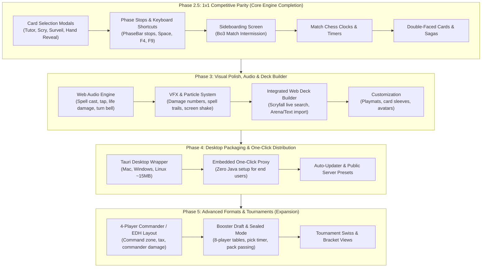

# Roadmap por fases (archivado)

> Secciones 4 (Phased Implementation Roadmap) y 5 (Technical Complexity & Effort Matrix) de `ROADMAP.md`, tal cual estaban el 2026-09-21. Describen el plan original de las fases 2.5 a 5, todas ya entregadas; el estado actual está en `ROADMAP.md` §2–§3 y lo pendiente en `ROADMAP.md` §4.

## 4. Phased Implementation Roadmap

---

### Phase 2.5: 1v1 Competitive Parity (Core Engine Completion)
*Objective: Make the web client 100% playable for all sanctioned 1v1 Constructed formats (Modern, Standard, Pioneer, Legacy, Vintage, Pauper).*

#### 2.5.1 Card Selection Modals (Tutors, Scry, Surveil, Hand Reveal) — **CRITICAL**
- **XMage Events**: `GAME_CHOOSE_CARDS`, `SHOW_CARDS`, `GAME_TARGET` with `cardsView1` lists.
- **Features**:
  - Modal card-grid overlay styled after modern digital card games.
  - Search library (Fetchlands, Demonic Tutor).
  - Scry / Surveil / Look at top N cards (allow reordering/placing on top or bottom).
  - Reveal hand effects (*Thoughtseize*, *Inquisition of Kozilek*): view opponent's hand in a dedicated reveal window (`game.revealed`/`game.opponentHands` en `OpponentZone`) and click to discard — implementado: `GAME_CHOOSE_CARDS`/`GAME_SELECT_TARGETS` con la mano ajena como `cardsView1` enrutan a la grilla HD `CardGrid` y el clic envía `sendPlayerUUID` (ver `e2e/reveal.spec.ts`, `@reveal`).
  - Graveyard / Exile selective interactions (reanimation, flashback picker).

#### 2.5.2 Phase Stops & Priority Shortcuts — **CRITICAL**
- **Features**:
  - Interactive stop markers on `PhaseBar`: click on specific steps (Upkeep, Draw, Precombat Main, Beginning of Combat, Declare Attackers, End of Combat, Postcombat Main, End Step) to set personal stops.
  - Standard priority keyboard shortcuts:
    - **Space / Enter**: Yield current priority (pass).
    - **F4**: Pass priority until stack is non-empty or an opponent acts.
    - **F9**: Pass all priority until end of turn.
    - **Ctrl**: Hold full priority.

#### 2.5.3 Sideboard Screen (Best-of-3 / Best-of-5 Matches) — **HIGH**
- **Features**:
  - Intermission screen between match games when `GAME_SIDEBOARD` is received.
  - Two-column visual deck editor (Maindeck $\leftrightarrow$ Sideboard).
  - Drag-and-drop / single-click card swap with real-time deck size validation.
  - Countdown timer for sideboarding with "Submit Deck" action.

#### 2.5.4 Match Clocks & Priority Timers — **MEDIUM**
- **Features**:
  - Render active chess clocks for both players (turn timer & match timer).
  - Visual warning indicators when player time drops below critical thresholds (flashing amber/red).

#### 2.5.5 Double-Faced Cards (DFCs), MDFCs & Sagas — **MEDIUM**
- **Features**:
  - Card flip button / keyboard shortcut to preview and choose the back face of MDFCs in hand.
  - In-play transformation animations/transitions.
  - Saga layout with active chapter token overlay.

#### 2.5.6 Multi-Blocker Combat Damage Assignment — **LOW**
- **Features**:
  - Reorder blocker assignment dialog when an attacking creature is blocked by multiple defending creatures.

---

### Phase 3: Visual Polish, Audio & Integrated Deck Builder
*Objective: Transform the functional client into a premium, responsive Arena-quality experience.*

#### 3.1 Audio Engine (Web Audio API)
- Sound FX for core interactions: card draw, card tap, spell cast whoosh, land drop, creature attack impact, life total counter tick, turn bell/notification chimes.
- Volume sliders in settings (Master, SFX, Ambient).

#### 3.2 VFX & Visual Effects (CSS & SVG Overlays)
- Spell resolution visual trajectories (arcs from hand $\to$ stack $\to$ battlefield/graveyard).
- Combat impact effects: screen shake on heavy damage, floating $-X$ life numbers.

#### 3.3 Integrated Web Deck Builder
- In-client Scryfall search with full syntax (`t:creature c:red cmc<=3 o:"haste"`).
- Visual deck view (stacks sorted by mana cost, color breakdown chart, mana curve histogram).
- One-click clipboard import/export in Arena, plain text, and `.dck` formats.
- Sample hand generator (Goldfish opening hand simulator).

#### 3.4 Player Customization
- Selectable playmat background themes (Dark fantasy, Sci-fi, Minimalist wood, Animated nebula).
- Custom card back sleeves.

---

### Phase 4: Desktop Packaging & One-Click Distribution (Tauri) — ✅ publicado (v0.1.0 2026-09-10, v0.2.0 2026-09-19; validación en máquinas limpias: plan5 V7)
*Objective: Provide a friction-free, zero-setup desktop application for non-technical users.*

#### 4.1 Tauri Native Wrapper
- Lightweight desktop application (<15 MB installer for Windows, macOS, and Linux).
- Native window chrome, hardware-accelerated WebGL viewport, and OS-native notifications when priority arrives while tabbed out.

#### 4.2 Embedded Proxy & JRE Management
- Bundle a headless, ultra-stripped OpenJDK 17 runtime + `mage-proxy.jar`.
- One-click launcher: automatically boots the local proxy in the background, handles port binding, and connects the UI instantly without user intervention.
- Preset selector: "Official Public Server (`beta.xmage.today`)" vs "Local Server" vs "Custom Server".

#### 4.3 Seamless Auto-Updater
- In-app background update downloads when new proxy or web releases are published.

---

### Phase 5: Advanced Game Modes & Tournaments (Expansion)
*Objective: Extend the platform to support popular casual and limited formats.*

#### 5.1 4-Player Commander (EDH) / Brawl
- 4-quadrant dynamic board layout with individual player life totals, mana pools, and status bars.
- Dedicated Command Zone for each player displaying Commander cards.
- Trackers for Commander Tax ($+2$ per cast) and Commander Damage matrices (tracking damage dealt by each commander to each player).
- Turn order ring visualizer.

#### 5.2 Booster Draft & Sealed Tournaments
- 8-player draft table room with synchronous pick timers.
- Booster pack opening animation and card pick selection grid.
- Pack passing indicators (Pack 1 Left, Pack 2 Right, Pack 3 Left).
- Integrated 40-card limited deck builder during deckbuilding rounds.

#### 5.3 Swiss & Single Elimination Tournament Brackets
- Real-time tournament lobby with bracket visualization, pairing announcements, and standings tables.

---

## 5. Technical Complexity & Effort Matrix

| Phase | Milestone | Technical Complexity | Core Dependencies |
|---|---|---|---|
| **Phase 2.5** | Card Selection Modals | 🟡 Medium | React Card Grid, `GAME_CHOOSE_CARDS` mapper |
| **Phase 2.5** | Phase Stops & F4/F9 Shortcuts | 🟡 Medium | `PhaseBar` state, key listener, auto-pass logic |
| **Phase 2.5** | Sideboard Screen | 🟢 Low-Medium | 2-column drag-drop UI, `GAME_SIDEBOARD` action |
| **Phase 2.5** | Match Clocks | 🟢 Low | Client-side countdown syncing with server updates |
| **Phase 2.5** | Double-Faced Cards / Sagas | 🟢 Low-Medium | Scryfall back-face cache, card hover flip |
| **Phase 3** | Audio Engine | 🟢 Low | Web Audio API / Howler.js, sound asset pack |
| **Phase 3** | VFX & Visual Animations | 🟢 Low-Medium | CSS3 keyframes, SVG overlays & tween engine |
| **Phase 3** | In-App Deck Builder | 🟡 Medium | Scryfall REST API search, text format parsers |
| **Phase 4** | Tauri Desktop Launcher | 🟢 Low-Medium | Tauri 2.0, Rust process launcher for Java JAR |
| **Phase 5** | 4-Player Commander Layout | 🔴 High | Complete board geometry overhaul (4 quadrants) |
| **Phase 5** | Booster Draft & Tournament System | 🔴 High | Multi-client draft synchronization, draft timers |

---
