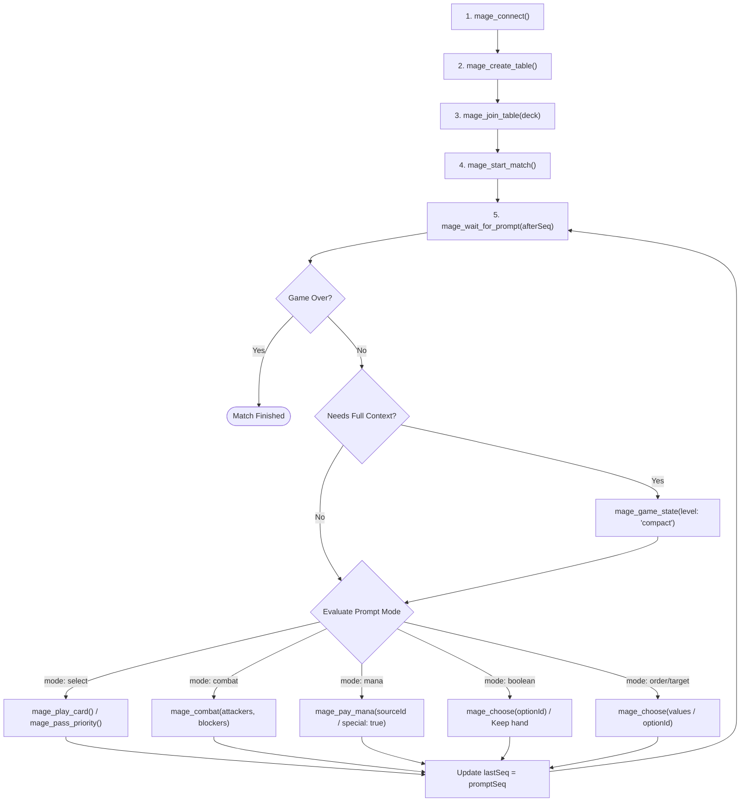

# XMage Nexus MCP Server: Architecture, Tools & Autonomous LLM Gameplay

The **XMage Nexus MCP server** (`mcp/`) is a standalone Model Context Protocol (stdio) server designed to enable AI agents and Large Language Models (LLMs) to interact with Magic: The Gathering (MTG) through XMage. It serves two distinct purposes:
1. **DevOps & Diagnostics:** Controlling the development stack, inspecting server/proxy logs, and driving test suites.
2. **Autonomous Headless Player:** Allowing an LLM to connect, navigate lobbies, construct decks, and play full games of MTG from start to finish against human players or bots (`SIM`).

---

## 1. Can an LLM Play MTG From Start to Finish?

**Yes.** The MCP server includes a dedicated gameplay abstraction layer (Phases C1, C2, and C3) designed specifically to overcome MTG's core challenges for AI models:

* **Token Context Efficiency:** Raw XMage network frames contain massive Java DTOs (thousands of lines of JSON per event). The MCP digests these into clean, compact state views (`mage_game_state`) containing only what is needed: life totals, hand, board state with stats/tapped status/damage/summoning sickness, stack contents, and playable card IDs.
* **Priority Flooding Mitigation (Auto-Pass):** MTG requires dozens of priority passes per turn (across steps, phases, and opponent turns). The MCP handles meaningless priority passes automatically in the background via `mage_auto_pass` (enabled by default). It only yields control to the LLM when there is an active decision to be made.
* **Normalized Prompts:** Complex game choices (mulligans, mana payments, declaring attackers/blockers, target selections, modes, stack ordering) are normalized into standardized decision modes (`select`, `boolean`, `combat`, `mana`, `order`, `integer`, `uuid`, `string`).
* **Verified End-to-End Tests:** Fully verified in automated integration tests (e.g., [`mcp/test/realGame.test.ts`](../mcp/test/realGame.test.ts)), where a headless agent plays against a simulation bot through all game phases until `gameOver`.

---

## 2. The Canonical LLM Gameplay Loop

An LLM agent plays by looping over `mage_wait_for_prompt`:



### Execution Walkthrough

```typescript
// 1. Establish connection and join a match
await client.callTool("mage_connect", { username: "agent-player" });
const table = await client.callTool("mage_create_table", {
  playerTypes: ["HUMAN", "SIM"],
  gameType: "Two Player Duel",
  deckType: "Constructed - Pioneer"
});
await client.callTool("mage_join_table", { tableId: table.tableId, deck: myDeckJson });
const match = await client.callTool("mage_start_match", { tableId: table.tableId });

// 2. Play loop
let lastSeq = 0;
while (true) {
  const waitResult = await client.callTool("mage_wait_for_prompt", { 
    afterSeq: lastSeq, 
    timeoutMs: 30000 
  });
  
  if (waitResult.gameOver) {
    console.log("Game finished!", waitResult.data);
    break;
  }
  
  if (waitResult.timeout) continue;
  lastSeq = waitResult.promptSeq;
  
  const prompt = waitResult.prompt;
  
  // Decide action based on normalized prompt mode
  switch (prompt.mode) {
    case "boolean":
      // E.g., Mulligan decision: Keep (false) or Mulligan (true)
      await client.callTool("mage_choose", { optionId: prompt.options[0].id });
      break;
      
    case "select":
      // Main phase priority: play a land, cast a spell, or pass
      const state = await client.callTool("mage_game_state", { level: "compact" });
      const playable = state.state.hand.find(card => card.playable);
      if (playable) {
        await client.callTool("mage_play_card", { cardId: playable.id });
      } else {
        await client.callTool("mage_pass_priority", {});
      }
      break;
      
    case "mana":
      // Auto-pay mana if available, or tap specific land
      await client.callTool("mage_pay_mana", { special: true });
      break;
      
    case "combat":
      // Declare attackers or blockers
      await client.callTool("mage_combat", { 
        attackers: prompt.options.map(o => o.id), 
        confirm: true 
      });
      break;
      
    default:
      await client.callTool("mage_choose", { optionId: prompt.options[0]?.id });
      break;
  }
}
```

---

## 3. Complete MCP Tools Reference

### A. Gameplay & LLM Interaction

| Tool | Key Arguments | Purpose |
|---|---|---|
| `mage_wait_for_prompt` | `timeoutMs`, `afterSeq`, `session?` | **Main blocking primitive**. Waits for an engine decision prompt or `gameOver`. Returns normalized prompt schema and incremental `promptSeq`. |
| `mage_game_state` | `level` (`compact` \| `full`), `session?` | Returns optimized board state (life, hand, battlefield with stats and sickness, stack, playable IDs). |
| `mage_choose` | `optionId`, `value`, `values`, `session?` | Universal prompt responder: by option ID, direct value (int/bool/str), or index array `values` (for ordering triggers/assigning damage). Supports `optionId: "special"`. |
| `mage_play_card` | `cardId`, `session?` | Plays a land, casts a spell, or activates an ability by UUID. |
| `mage_pay_mana` | `sourceId?`, `manaType?`, `special?`, `session?` | Pays mana costs via source UUID, mana pool color (`W/U/B/R/G/C`), or auto-pay (`special: true`). |
| `mage_combat` | `attackers?`, `blockers?`, `blockTargets?`, `confirm?`, `targetTimeoutMs?`, `session?` | Declares attackers/blockers. Handles gang-blocking by automatically answering interleaved `GAME_TARGET` prompts. |
| `mage_pass_priority` | `session?` | Sends `sendPlayerBoolean(false)`: passes priority, confirms combat choices, or declines optional effects. |
| `mage_auto_pass` | `enabled`, `session?` | Toggles automated priority passes for empty windows. Includes anti-flood protection (>5 repeated prompts triggers fallback). |
| `mage_action` | `kind`, `value?`, `action?`, `data?`, `force?`, `session?` | Raw escape hatch for low-level protocol calls (uuid, boolean, integer, string, manaType, playerAction). |
| `mage_concede` | `session?` | Concedes the active game without leaving the table/match. |
| `mage_chat` | `text`, `chatId?`, `session?` | Sends in-game chat messages. |
| `mage_cheat_setup` | `playerId?`, `hand?`, `battlefield?`, `library?`, `graveyard?`, `exile?`, `session?` | *(Local server `testMode` only)* Seeds specific cards by name into zones for deterministic testing and benchmark reproduction. |

### B. Session, Lobby & Tournament Management

| Tool | Key Arguments | Purpose |
|---|---|---|
| `mage_connect` | `proxyUrl?`, `host?`, `port?`, `username?`, `password?`, `session?`, `timeoutSec?` | Opens the WebSocket to `Mage.Proxy` and logs in to the target XMage server (supports `localhost` and `beta.xmage.today`). |
| `mage_disconnect` | `session?` | Closes the connection and cleans up the remote session. |
| `mage_reconnect` | `session?` | Reopens WS connection using cached credentials and resynchronizes active game state (`joinGame`). |
| `mage_lobby` | `limit?`, `session?` | Lists current tables, seats, player names, and server statistics. |
| `mage_create_table` | `name?`, `gameType?`, `deckType?`, `winsNeeded?`, `playerTypes?`, `simDecks?`, `session?` | Creates a game table (e.g. 1v1 against a proxy-hosted `SIM` bot). |
| `mage_join_table` | `tableId`, `deck`, `playerName?`, `playerType?`, `session?` | Seats the agent at a table with a serialized `DeckJson` deck. |
| `mage_start_match` | `tableId?`, `waitMs?`, `session?` | Starts the match once all seats are filled and returns `gameId`. |
| `mage_leave_table` | `tableId?`, `remove?`, `session?` | Leaves or deletes a table. |
| `mage_session` | `session?` | Returns snapshot of active connection, game state, and recent event ring buffer. |
| `mage_sessions` | *(none)* | Lists all active named sessions within the MCP process. |
| `mage_use_session` | `session` | Switches the default active session for unpinned calls. |
| `mage_create_tournament_table` | `name?`, `tournamentType?`, `limited?`, `limitedOptions?`, `session?` | Creates tournament tables (Sealed, Draft, Swiss, Elimination). |
| `mage_join_tournament_table` | `tableId`, `deck?`, `playerName?`, `session?` | Joins a tournament seat (deck is optional for Limited). |
| `mage_start_tournament` | `tableId?`, `waitMs?`, `session?` | Starts tournament and returns `tournamentId`. |
| `mage_join_tournament` | `tournamentId?`, `session?` | Connects agent to tournament controller panel (mandatory for progression). |
| `mage_join_game` | `gameId?`, `waitMs?`, `session?` | Attaches to a specific tournament match game or Bo3 game. |
| `mage_get_tournament` | `tournamentId?`, `session?` | Read-only inspection of tournament standings, pairings, and pools. |
| `mage_submit_deck` | `tableId?`, `deck`, `session?` | Submits constructed deck during Limited CONSTRUCT phase or Bo3 sideboarding. |
| `mage_watch_tournament_match` | `tableId`, `waitMs?`, `session?` | Spectates live matches in a tournament bracket. |

### C. DevOps & Test Suite Orchestration

| Tool | Key Arguments | Purpose |
|---|---|---|
| `mage_stack` | `action` (`status` \| `start` \| `stop` \| `restart`), `target` (`server` \| `proxy` \| `vite` \| `all`) | Controls local development processes via `scripts/ctl.mjs`. |
| `mage_logs` | `target`, `lines?`, `grep?`, `ignoreCase?` | Tails and filters logs from `.run/*.log`. |
| `mage_run_tests` | `layers?`, `skip?`, `timeoutSec?` | Runs test layers (`unit`, `typecheck`, `self-test`, `human-test`, `e2e`, etc.). |
| `mage_build` | `target` (`proxy` \| `full`), `timeoutSec?` | Builds proxy shaded jar or full engine fork. |
| `mage_record_fixture` | `mechanic`, `timeoutSec?` | Records live protocol frames for anti-drift golden testing. |
| `mage_validate_generated` | *(none)* | Checks generated TypeScript types, Zod schemas, and i18n bundles for drift. |
| `mage_e2e` | `spec?`, `grep?`, `backend` (`fake` \| `real`) | Runs Playwright browser tests across fake or real backends. |

---

## 4. Multi-Tenant Session Isolation

The MCP server supports running multiple concurrent agents or games inside a single MCP instance:
* **Session Pinning (`session` argument):** Every tool accepts an optional `session` string (e.g. `session: "agent_alpha"`). This isolates requests to that specific session without mutating the global active session, preventing race conditions during parallel game play.
* **Background Keep-Alive:** Inactive sessions continue receiving server events and processing auto-passes in the background without dropping connection leases.

---

## 5. Summary & Next Steps for Collaborators

1. **Running the MCP Server:**
   ```bash
   cd mcp
   npm install
   npm test
   node src/index.ts # Runs stdio transport
   ```
2. **Connecting from Claude Desktop / Cursor / Opencode:**
   Register the server command:
   ```json
   {
     "mcpServers": {
       "mage": {
         "command": "node",
         "args": ["/path/to/xmage-nexus/mcp/src/index.ts"]
       }
     }
   }
   ```
3. **Core Integration Files to Review:**
   * [`mcp/src/xmage/session.ts`](../mcp/src/xmage/session.ts): Complete implementation of session state, auto-pass, and tool handlers.
   * [`mcp/src/xmage/promptView.ts`](../mcp/src/xmage/promptView.ts): Normalization logic for all MTG prompt types.
   * [`mcp/src/xmage/compactView.ts`](../mcp/src/xmage/compactView.ts): Token-efficient game state compression.
   * [`mcp/test/realGame.test.ts`](../mcp/test/realGame.test.ts): End-to-end integration test demonstrating autonomous play.
